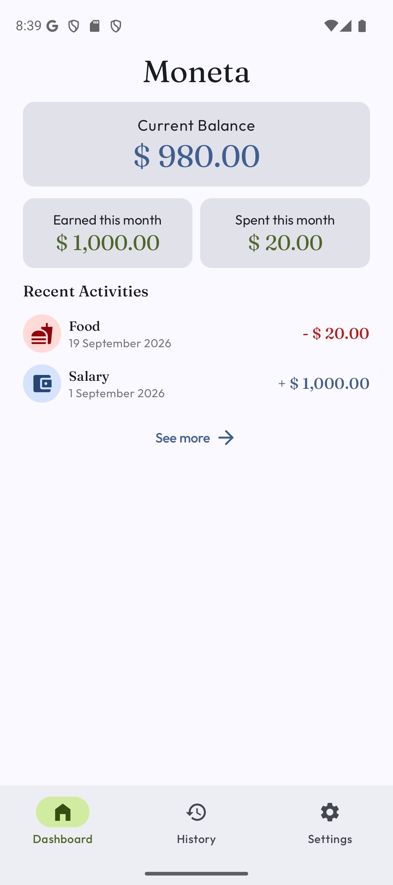
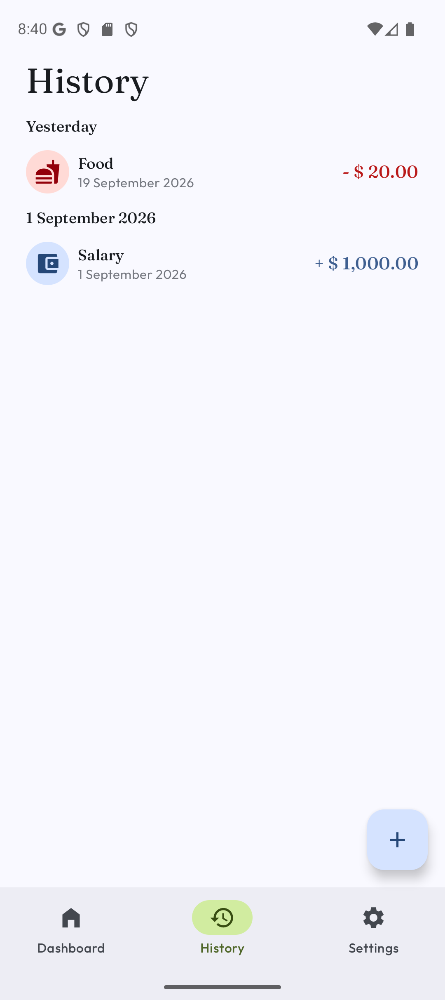
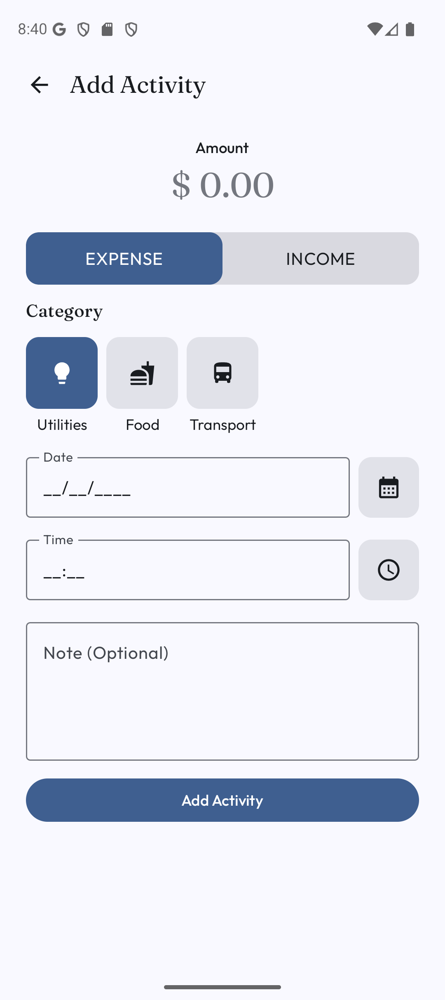
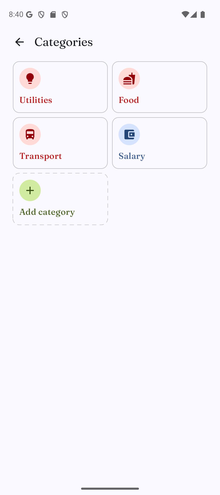
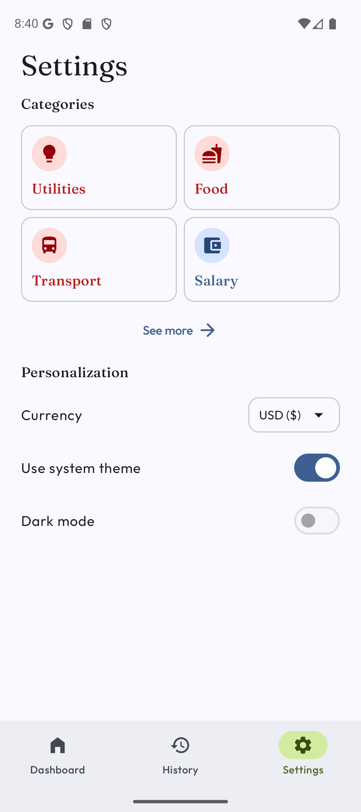

# Moneta

A lightweight, offline-first personal finance tracker for Android. Record income and expenses, organize them into categories, and keep an eye on your balance — all on your device.


## Screenshots

| Dashboard | History | Add Activity |
|---|---|---|
|  |  |  |

| Categories | Settings |
|---|---|
|  |  |

## Features

- **Dashboard** — instantly see earned, spent, and current balance for the month, plus recent activities.
- **Activity tracking** — add, edit, view, and delete income/expense entries with amount, category, date, time, and an optional note.
- **Categories** — organize transactions into expense or income categories, each with its own icon; create, edit, and delete them.
- **History** — browse your past activities in a single scrollable list.
- **Multi-currency** — switch between **IDR** and **USD** with proper currency symbol and formatting.
- **Theming** — follow the system theme or force dark mode.
- **100% offline** — all data is stored locally on-device (Room); no account or internet required.
- **Material 3** — modern Jetpack Compose UI that adapts to light and dark.
- **Fully tested core logic** — unit tests for formatters, repositories, and ViewModels.

## Tech Stack & Architecture

| Layer | Choice |
|---|---|
| UI | Jetpack Compose + Material 3 |
| Navigation | [Navigation 3](https://developer.android.com/guide/navigation/navigation3) with type-safe `@Serializable` routes |
| Architecture | MVVM with unidirectional data flow (`UiState` / `UiEvent` / `UserEvent` per feature) |
| DI | Hilt (KSP) |
| Persistence | Room 3 (KSP) with KSP schema generation |
| Serialization | kotlinx.serialization |
| Testing | JUnit 4, MockK, kotlinx-coroutines-test, Compose UI test |

- **Kotlin** 2.4.20 · **AGP** 9.4.1 · **Gradle** 9.7.1 · **Compose BOM** 2026.09.00 · **KSP** 2.3.6
- `minSdk` **24** · `compileSdk` / `targetSdk` **37** · Java 11 bytecode
- Single-module layout (`:app`) organized by feature packages rather than multi-module.

## Download / Installation

Prebuilt APKs are not published yet. Until then, [build from source](#build--setup-instructions).

<!-- When available, add links here:
- [GitHub Releases](https://github.com/<your-username>/Moneta/releases)
- [F-Droid](https://f-droid.org/packages/com.felixj.moneta)
- [Google Play](https://play.google.com/store/apps/details?id=com.felixj.moneta)
-->

## Build & Setup Instructions

### Prerequisites

- **JDK 17+** (the project uses Java 11 source/target compatibility)
- **Android Studio** latest stable (project uses recent AGP 9.x / Kotlin 2.4.x tooling)
- Android SDK with `platform 37` and its build tools (Android Studio can install these on first sync)

### Build from the command line

```bash
# Clone & build a debug APK
git clone https://github.com/<your-username>/Moneta.git
cd Moneta
./gradlew assembleDebug
```

The debug APK is written to `app/build/outputs/apk/debug/app-debug.apk`. Install it on a connected device with:

```bash
./gradlew installDebug
```

No API keys or environment variables are required — the app runs fully offline. `local.properties` (created automatically by Android Studio) should contain your `sdk.dir` and must not be committed.

### Useful tasks

```bash
./gradlew testDebugUnitTest   # run unit tests
./gradlew connectedDebugAndroidTest  # run instrumented tests (needs a device/emulator)
./gradlew lint                # run Android lint
```

## Project Structure

```
Moneta/
├── app/
│   ├── schemas/                  # Room schema exports (KSP)
│   └── src/
│       ├── main/java/com/felixj/moneta/
│       │   ├── ui/theme/         # Compose theme: Color, Type, Theme
│       │   ├── dashboard/        # Dashboard feature (view, viewmodel, model)
│       │   ├── activity/         # Add/Edit/Detail activity pages
│       │   ├── categories/       # Categories root, add/edit/detail pages
│       │   ├── history/          # Full activity history
│       │   ├── settings/         # Currency, dark mode, categories management
│       │   ├── shared/           # Reusable views, repository, Room (dao/entity/db), utils
│       │   ├── MainActivity.kt   # NavDisplay + Nav3 entry graph
│       │   └── MonetaApplication.kt
│       ├── test/                 # JVM unit tests (JUnit, MockK, coroutines-test)
│       └── androidTest/          # Instrumented tests
├── gradle/
│   └── libs.versions.toml        # Centralized dependency catalog
├── build.gradle.kts
├── settings.gradle.kts           # Module graph (single `:app` module)
└── gradle.properties
```

Each feature follows the same pattern: `view/` (Composables), `viewmodel/`, and `model/` (`UiState`, `UiEvent`, `UserEvent`).

## Contributing

Contributions are welcome!

1. **Open an issue first** for bug reports or feature requests describing the problem/motivation.
2. **Fork** the repo and create a feature branch (`git checkout -b feat/my-feature`).
3. **Match existing conventions** — UDF/MVVM structure per feature, Material 3 Compose components, and the version catalog (`gradle/libs.versions.toml`) for any new dependencies.
4. **Add tests** for any non-trivial logic (formatters, repositories, ViewModels) and ensure existing ones pass.
5. Open a **pull request** referencing the issue. Keep changes focused and describe what/why.

> **Note on formatting/linting:** the project does not currently configure Spotless or Detekt. Adhere to [kotlin.code.style=official](https://kotlinlang.org/docs/coding-conventions.html) (set in `gradle.properties`) and run `./gradlew lint` before pushing.

## License & Disclaimers

Moneta is licensed under the **Apache License 2.0**. See [LICENSE](LICENSE) for the full license text.

```
Copyright 2026 the Moneta contributors

Licensed under the Apache License, Version 2.0 (the "License");
you may not use this file except in compliance with the License.
You may obtain a copy of the License at

    http://www.apache.org/licenses/LICENSE-2.0

Unless required by applicable law or agreed to in writing, software
distributed under the License is distributed on an "AS IS" BASIS,
WITHOUT WARRANTIES OR CONDITIONS OF ANY KIND, either express or implied.
See the License for the specific language governing permissions and
limitations under the License.
```

All trademarks and brand references belong to their respective owners.

## Acknowledgments & Credits

- [Jetpack Compose](https://developer.android.com/jetpack/compose) & [Material 3](https://m3.material.io/) — UI toolkit
- [Navigation 3](https://developer.android.com/guide/navigation/navigation3) — type-safe in-app navigation
- [Hilt](https://dagger.dev/hilt/) — dependency injection
- [Room (3)](https://developer.android.com/kotlin/room) — local persistence
- [kotlinx.serialization](https://github.com/Kotlin/kotlinx.serialization) — type-safe route serialization
- [MockK](https://mockk.io/) & [kotlinx-coroutines-test](https://github.com/Kotlin/kotlinx.coroutines) — testing
- [Material Symbols](https://fonts.google.com/icons) — in-app icons